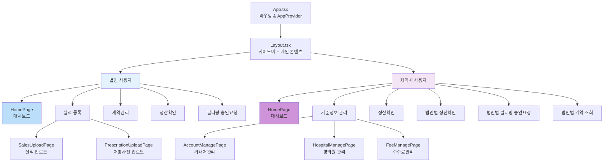
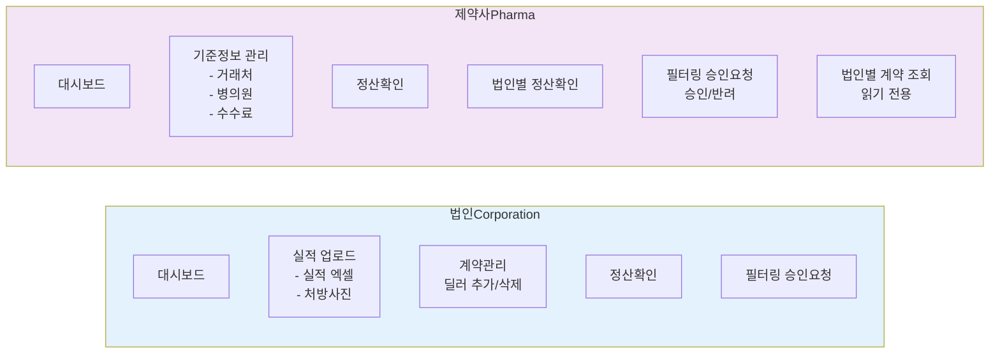
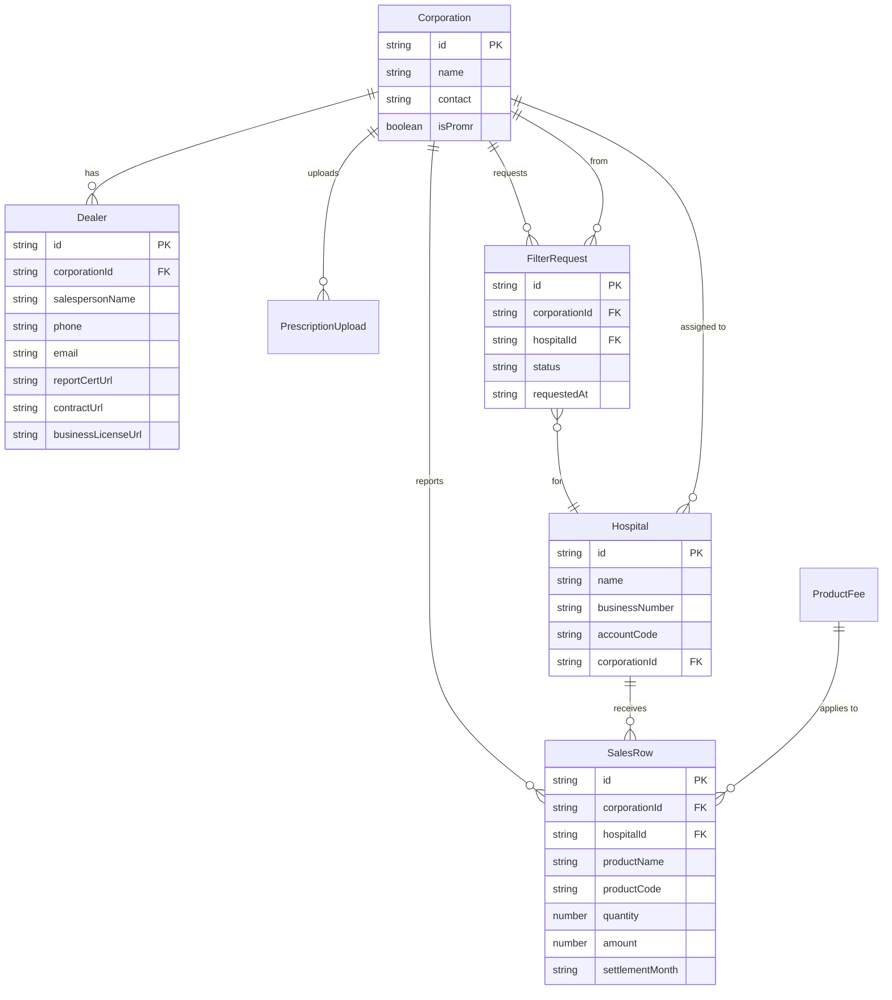
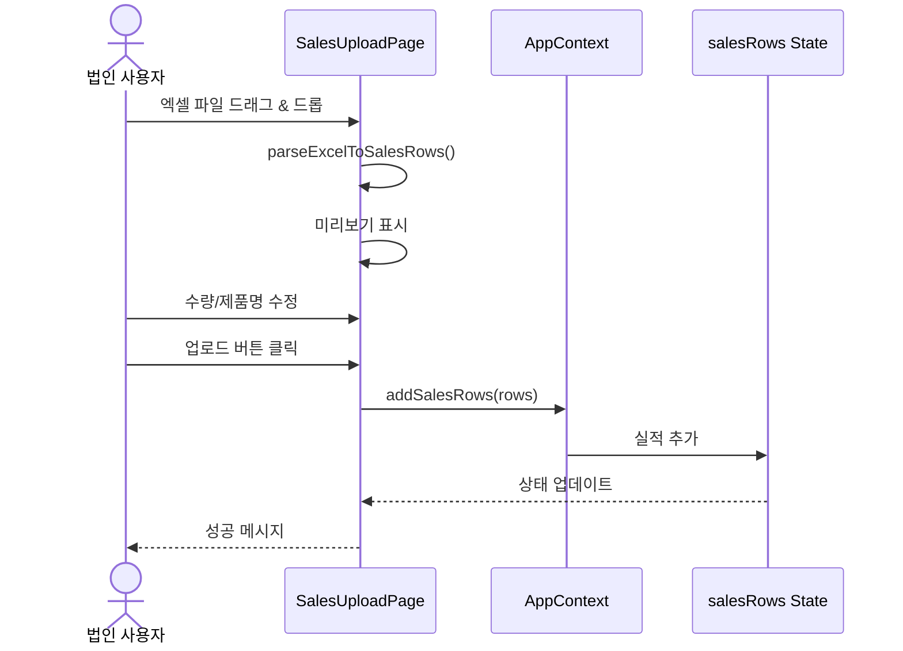
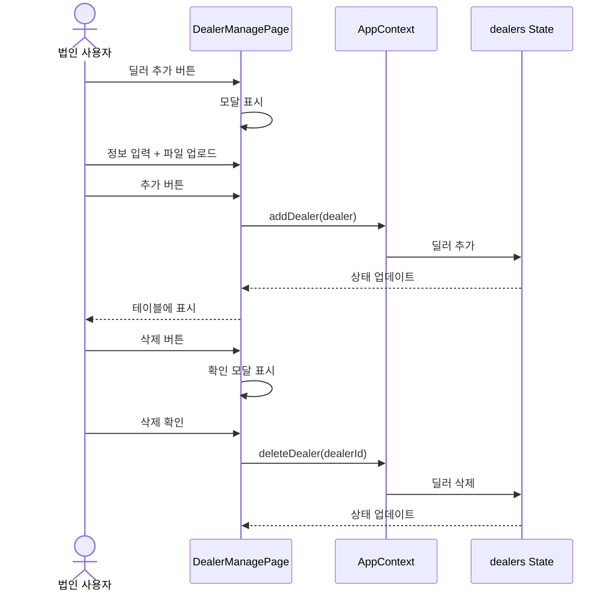
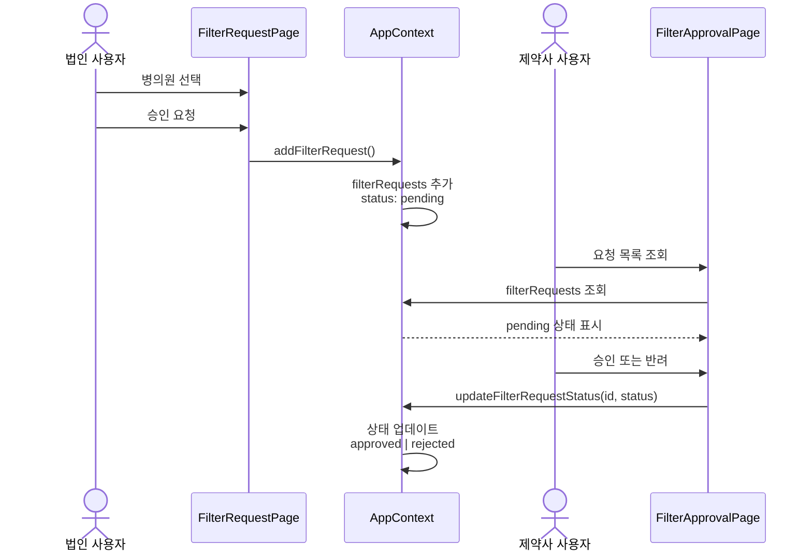
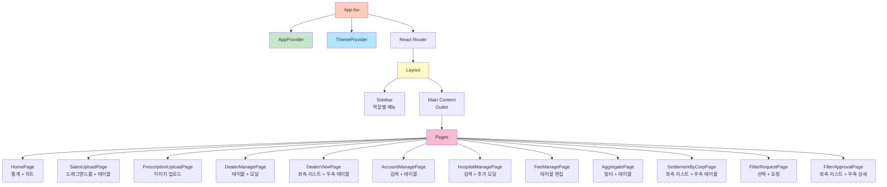
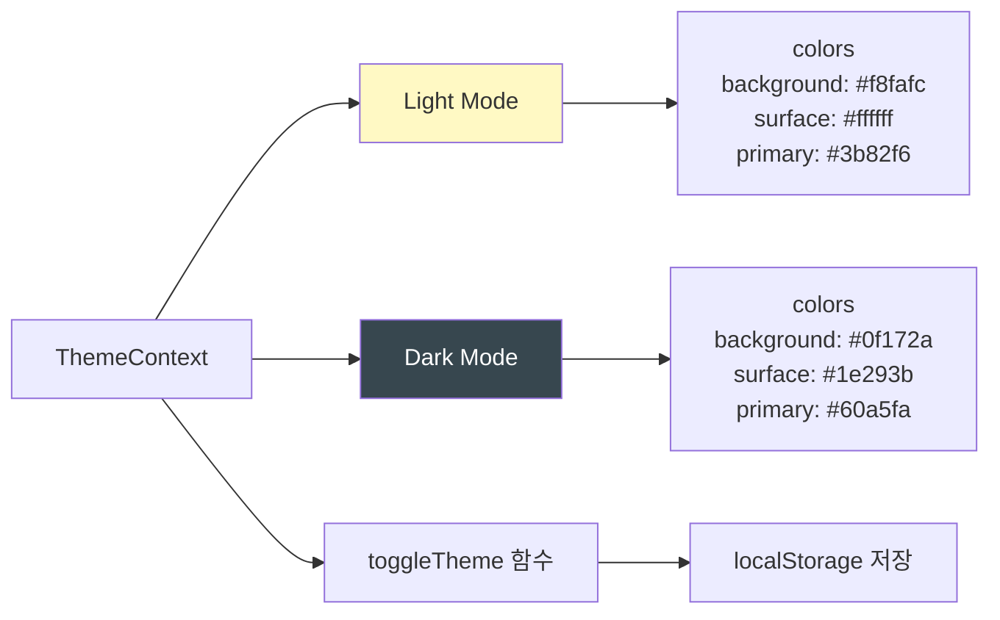

# Promr Brand Chart - 애플리케이션 구조

## 전체 시스템 구조



## 사용자 역할별 페이지 접근 권한



## 데이터 모델 관계



## 상태 관리 (AppContext)

```mermaid
graph TB
    subgraph AppContext
        State[전역 상태]
        Actions[액션]
    end
    
    State --> UserRole[userRole<br/>corporation | pharma]
    State --> CurrentCorp[currentCorporationId]
    State --> Corps[corporations 배열]
    State --> Hospitals[hospitals 배열]
    State --> Sales[salesRows 배열]
    State --> Prescriptions[prescriptionUploads 배열]
    State --> Filters[filterRequests 배열]
    State --> Dealers[dealers 배열]
    
    Actions --> SetRole[setUserRole]
    Actions --> SetCorp[setCurrentCorporationId]
    Actions --> AddSales[addSalesRows]
    Actions --> AddPrescription[addPrescriptionUpload]
    Actions --> AddHospital[addHospital]
    Actions --> UpdateFilter[updateFilterRequestStatus]
    Actions --> AddFilter[addFilterRequest]
    Actions --> AddDealer[addDealer]
    Actions --> DeleteDealer[deleteDealer]
    
    style State fill:#fff3e0
    style Actions fill:#e1f5fe
```

## 주요 기능 흐름

### 1. 실적 업로드 (법인)



### 2. 딜러 관리 (법인)



### 3. 필터링 승인 (제약사)



## 라우팅 구조

```mermaid
graph TB
    Root[/ - HomePage]
    
    Root --> Upload[/upload/*]
    Root --> Dealer[/dealer-*]
    Root --> Management[기준정보 관리]
    Root --> Settlement[정산 관련]
    Root --> Filter[필터링]
    
    Upload --> UploadSales[/upload/sales<br/>실적 업로드]
    Upload --> UploadPrescription[/upload/prescription<br/>처방사진 업로드]
    
    Dealer --> DealerManage[/dealer-manage<br/>계약관리 법인]
    Dealer --> DealerView[/dealer-view<br/>계약 조회 제약사]
    
    Management --> Accounts[/accounts<br/>거래처관리]
    Management --> Hospitals[/hospitals<br/>병의원 관리]
    Management --> Fees[/fees<br/>수수료관리]
    
    Settlement --> Aggregate[/aggregate<br/>정산확인]
    Settlement --> SettlementCorp[/settlement<br/>법인별 정산확인]
    
    Filter --> FilterRequest[/filter-request<br/>필터링 요청 법인]
    Filter --> FilterApproval[/filter-approval<br/>필터링 승인 제약사]
    
    style Root fill:#fff9c4
    style Upload fill:#e3f2fd
    style Dealer fill:#f3e5f5
    style Management fill:#e8f5e9
    style Settlement fill:#fce4ec
    style Filter fill:#fff3e0
```

## 컴포넌트 계층 구조



## 테마 시스템



## 파일 구조

```
src/
├── components/
│   └── Layout.tsx          # 사이드바 + 메인 레이아웃
├── pages/
│   ├── HomePage.tsx        # 대시보드 (통계 + 차트)
│   ├── SalesUploadPage.tsx
│   ├── PrescriptionUploadPage.tsx
│   ├── DealerManagePage.tsx    # 법인: 딜러 관리
│   ├── DealerViewPage.tsx      # 제약사: 딜러 조회
│   ├── AccountManagePage.tsx
│   ├── HospitalManagePage.tsx
│   ├── FeeManagePage.tsx
│   ├── AggregatePage.tsx
│   ├── SettlementByCorpPage.tsx
│   ├── FilterRequestPage.tsx   # 법인: 필터링 요청
│   └── FilterApprovalPage.tsx  # 제약사: 필터링 승인
├── context/
│   ├── AppContext.tsx      # 전역 상태 관리
│   └── ThemeContext.tsx    # 테마 관리
├── types/
│   └── index.ts            # 타입 정의
├── store/
│   └── mockData.ts         # 목 데이터
├── theme.ts                # 테마 설정
└── App.tsx                 # 라우팅 설정
```
